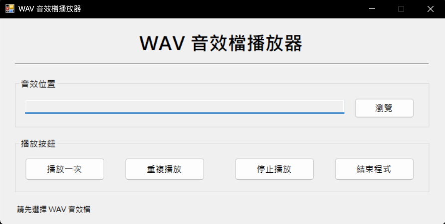

# WAV 音效檔播放器

學號：1121427
姓名：石秉璿

本專案為「視窗程式設計 (II)」上課練習：WAV 音效檔播放器。程式使用 Visual C# Windows Forms 製作，並使用 `System.Media.SoundPlayer` 類別播放 `.wav` 音效檔。

## 功能簡介

- 使用「瀏覽」按鈕開啟檔案對話方塊，選擇 WAV 音效檔。
- 使用「播放一次」播放選取的音效一次。
- 使用「重複播放」循環播放選取的音效。
- 使用「停止播放」停止目前音效。
- 使用「結束程式」關閉應用程式。
- 關閉視窗前會跳出確認訊息。

## 開發環境

- Visual Studio 2019 / 2022
- C# Windows Forms App (.NET Framework)
- .NET Framework 4.8

## 執行說明

1. 使用 Visual Studio 開啟 `WAVPlayer.sln`。
2. 按下 `F5` 或點選「開始偵錯」執行程式。
3. 按下「瀏覽」選擇 `.wav` 檔案。
4. 按下「播放一次」、「重複播放」或「停止播放」操作播放器。

專案已附上測試音效：`WAVPlayer/SampleAudio/XMAS.WAV`。

## 程式截圖

## 主要程式碼說明

本專案依照教學簡報實作：

- `using System.Media;`：引用播放 WAV 音效所需的命名空間。
- `SoundPlayer player = new SoundPlayer();`：建立音效播放器物件。
- `player.SoundLocation = txtPath.Text;`：指定 WAV 檔案位置。
- `player.Load();`：載入 WAV 音效檔。
- `player.Play();`：播放一次。
- `player.PlayLooping();`：重複播放。
- `player.Stop();`：停止播放。

## 專案檔案整理

繳交前請確認不要上傳或壓縮下列資料夾：

- `bin/`
- `obj/`
- `.vs/`
- `.git/`

本專案已提供 `.gitignore`，可避免將 Visual Studio 暫存檔與編譯檔提交到 GitHub。
